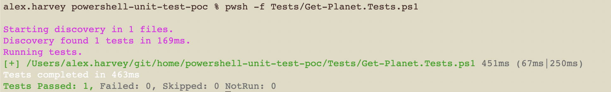

# Pester PoC

This shows how to set up Pester to test a PowerShell function.

## Usage

On a Mac:

Install PowerShell:

```text
% brew install --cask powershell
```

Install Pester:

```text
% pwsh
> Install-Module Pester -Force
```

Run the tests:

```text
% pwsh -f Tests/Get-Planet.Tests.ps1
```

## Output


